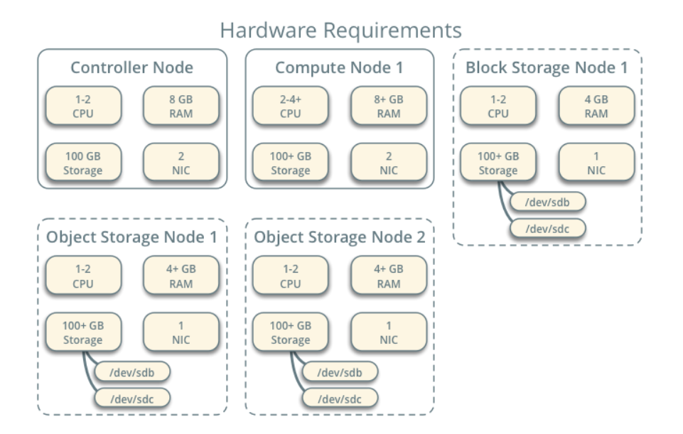

# Openstack Installation

- Controller : The controller node runs the Identity service, Image service, Placement service, management portions of Compute, management portion of Networking, various Networking agents, and the Dashboard. It also includes supporting services such as an SQL database, message queue, and NTP.

The controller node requires a minimum of two network interfaces.

- Compute : The compute node runs the hypervisor portion of Compute that operates instances. By default, Compute uses the KVM hypervisor. The compute node also runs a Networking service agent that connects instances to virtual networks and provides firewalling services to instances via security groups.

You can deploy more than one compute node. Each node requires a minimum of two network interfaces.

## Controller

### Keystone Installation Tutorial

### Architecture

- Controller node  
  - 2 vCPUs 
  - 8 GB RAM
  - 50 GB storage
  - 2 NIC

- Compute node
  - 2 vCPUs
  - 8 GB RAM
  - 50 GB storage
  - 2 NIC

