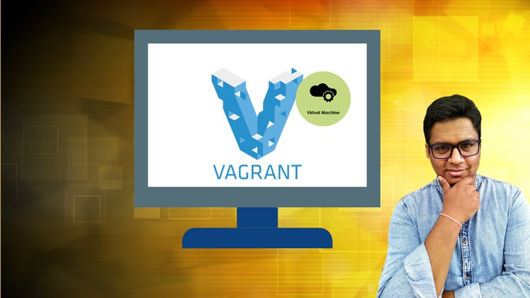

<!-- Place this tag where you want the button to render. -->
<a class="github-button" href="https://github.com/mohitkr05/vagrant" data-size="large" data-show-count="true" aria-label="Star mohitkr05/vagrant on GitHub">Star</a>

# Vagrant - A complete hands-on guide

Supporting documents and excercises for my Udemy Course [Vagrant - A hands-on course](https://www.udemy.com/course/vagrant-the-ultimate-course/?referralCode=2371934957EB05DA38C2)

## Overview

This project utilizes Vagrant, an open-source software product for building and maintaining portable virtual software development environments. Vagrant provides an easy-to-use workflow and focuses on automation, saving time and increasing productivity.
Prerequisites

- Vagrant
- VirtualBox or any other compatible provider
- Basic knowledge of virtualization
or, get my course

## Installation
- Install Vagrant: Download and install Vagrant from the official website.
- Install VirtualBox: Download and install VirtualBox from the official website. Alternatively, you can use any other provider that Vagrant supports.

## Usage
- Each directory contains a different project.
  - `git clone https://github.com/mohitkr05/vagrant.git`
- Enter the directory 
  - `cd vagrant`
- Check the project example 
  - cd `01_VM`
- Run the project
  - `vagrant up`

## Usage

    Suspend the VM: vagrant suspend - Save the current running state of the machine and stop it.
    Resume the VM: vagrant resume - Resume a suspended machine.
    Halt the VM: vagrant halt - Shut down the running machine.
    Destroy the VM: vagrant destroy - Remove all traces of the virtual machine.

## Customization

You can customize your Vagrant environment by editing the Vagrantfile. This includes configurations like:

 - VM Box selection
 - Network settings
 - Synced folders
 - Provider-specific settings

## Contributing

Contributions to this project are welcome!

## License

This project is licensed under the MIT License.

## Acknowledgements

Thanks to the Vagrant community for their continuous support and contributions.